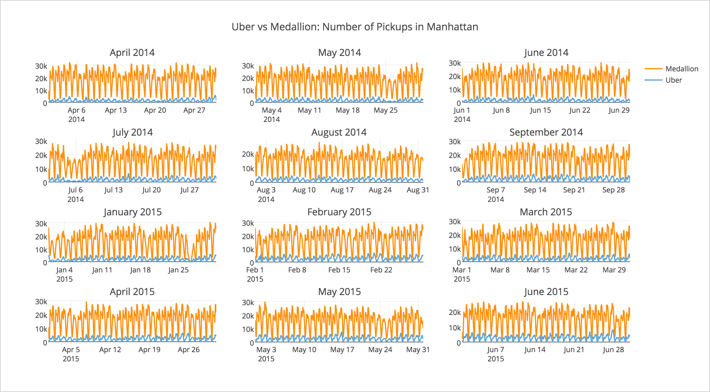
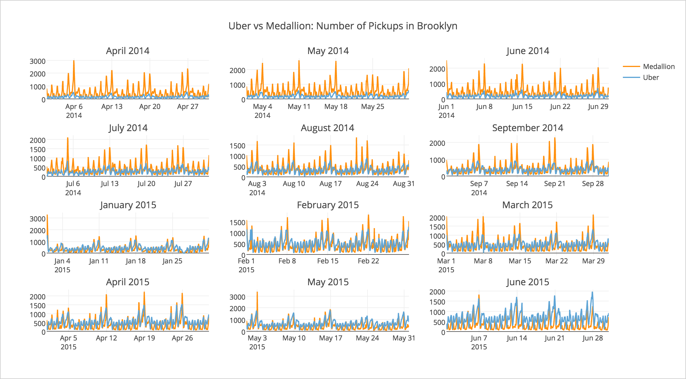
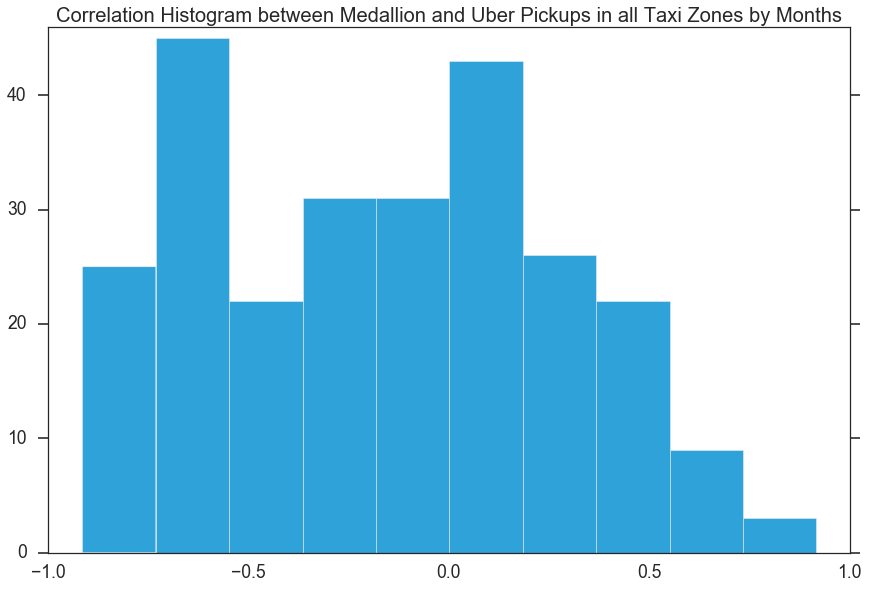
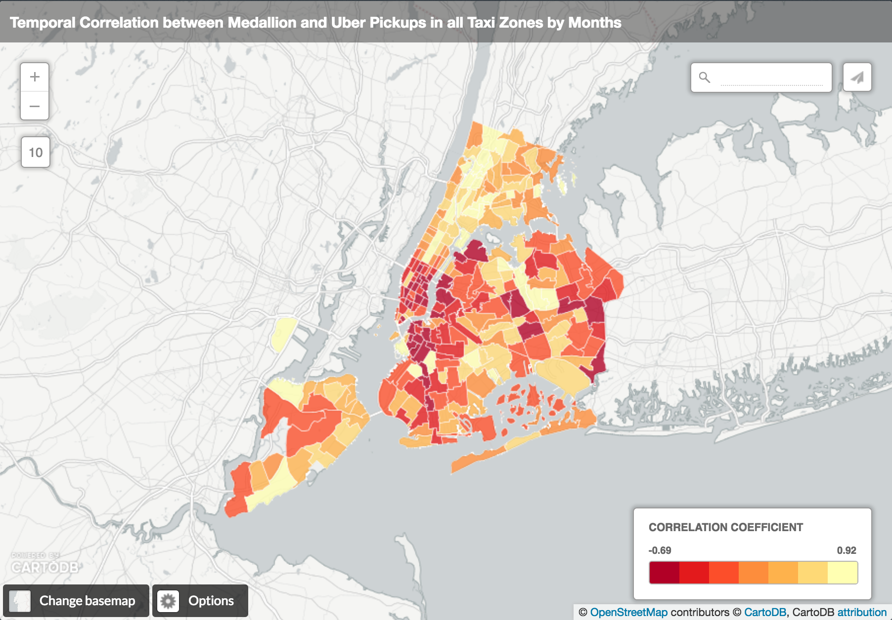
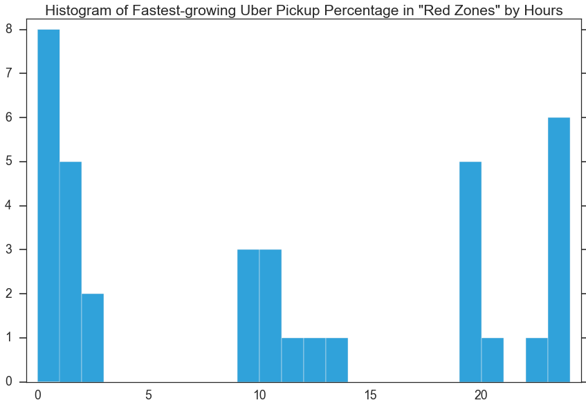

### Group Members
            
Shi Fan (sf2632)
       
Tengfei Zheng (tz869)

Vipassana Vijayarangan (vv744)

### Project Description

We intend to compare Uber pickups with Medallion pickups in New York City during time intervals Apr-Sept 2014 and Jan-Jun 2015. Such time is selected in order to be consistent with the limited Uber data provided by [FiveThirtyEight](https://github.com/fivethirtyeight/uber-tlc-foil-response). We are interested in finding out what kind of potential impacts that Uber may have on Medallion across each and every taxi zone in NYC, by analyzing the number of pickups in each zone at an hourly level from day to day. We aim to identify the taxi zones in which Uber has been stealing trips away from Medallion, which is demonstrated by the [correlation map](https://raw.githubusercontent.com/fanshi118/UberTaxi/master/plots/correlation_map.png). The "Red Zones" are the ones identified. In addition, we intend to find in which hour of the day Uber has been stealing trips away from Medallion within those "Red Zones," which is demonstrated by the ["Red Zones" histogram by hours](https://raw.githubusercontent.com/fanshi118/UberTaxi/master/plots/redzone_histogram_hour.png).

### Steps to Run

Run the folders in sequential order as listed below

`parsers` - generate `data/medallion` and `data/uber`

`spatialJoin` - generate `data/preprocessed`

`mapreduce` - generate `data/aggregated/medallion_agg_output`, `data/aggregated/uber14_agg_output`, and `data/aggregated/uber15_agg_output`

`postprocessing` - generate `data/aggregated/*.csv`

`analysis` - generate `plots` and `data/geo/correlation_by_zones.csv`

### Result

In the exploratory analysis, we plotted the number of pickups in each hour over the specified 12 months in Manhattan and Brooklyn. Judging the plot, we think that Uber pickups tend to increase in a faster speed in Brooklyn than they do in Manhattan.

Then we attempted to find the correlation between Uber and Medallion pickups at a taxi-zone level through time series analysis. For each zone, the correlation coefficient is defined by the Pearson's correlation between the number of Uber pickups in each month and that of Medallion in each month. Shown below is the histogram of the correlation coefficients across all taxi zones, 260 in total. The result is that Uber and Medallion pickups tend to be negatively correlated in more than half of the  zones, which implies that the number of pickups between the two services have contrasting trends in more than half of the zones. By printing out the numbers in detail, we found out that Uber pickups had been increasing while Medallions decreasing in ALL of these zones. This partial result confirms our hypothesis that Uber has been stealing trips away from Medallion in at least some areas in NYC.

A map is a more straightforward to visualize this.

Then we went one step further by analyzing what was exactly going on in those "Red Zones" by looking into the hourly statistics of those zones in the darkest red on the map above. They are the zones that have the most contrasting trends in terms of Uber and Medallion pickups. There are 37 in total—**14 in Manhattan**, **14 in Brooklyn**, and **9 in Queens**. For each month in "Red Zones," we aggregated the number of trips by each hour during the day, computed the Uber pickup percentage by #uber/(#uber+#medallion) for each hour, and then attempted to identify in which hour the percentage of uber pickups have been increasing the most rapidly within the specified 12 months. The speed of increase is defined by the slope of the OLS regression on the 12 data points for each hour within the 37 zones. For each of the 37 zones, the hour that has the highest slope is counted into the histogram below. It looked like Ubers had been stealing or filling the gap of midnight trips from Medallions in these zones where Uber pickups had gone the most popular.

The top 5 of the "Red Zones" are—**Little Italy/NoLiTa, Manhattan**; **Jamaica Estates, Queens**; **Murray Hill, Manhattan**; **Alphabet City, Manhattan**; **Greenpoint, Brooklyn**. We noticed that some of those top players, such as Murray Hill, Alphabet City, and Greenpoint, do not actually have convenient subway access. Therefore, the increase in the volume of Uber pickups makes sense in these zones. Before Uber had gone popular, people in these areas might have used Medallions more often than people in other areas. Now they may have just switched from Medallions to Ubers, since the mobile app experience has made pickups arguably more convenient for riders. It also makes sense how midnight hours are the time when Uber steals the most trips from Medallion within these zones, because the train tend to run less frequently during late night. Building on top of the fact that some of these zones do not even have the most convenient subway access, Uber turns out to be the most reasonable option during midnight hours in "Red Zones."

In conclusion, Uber has had the most amount of impact on taxi pickups in Manhattan, Brooklyn, and Queens (especially Manhattan and Brooklyn). In addition to stealing trips away from Medallion in "Red Zones," it is more reasonable to claim that Uber has been filling the gap on the demand side of these areas. Midnight hours turn out to be the time when the number of Uber pickups go off the charts in "Red Zones." We assume that the inconvenient/inadequate subway access has played a role in generating such statistical results. Ultimately, in order to get a better handle on the issue, it may be helpful incorporate other types of transportation means, as well as other types of taxi (i.e. Lyft, Green Boro Taxi, etc.), into the analysis, even though the goal is just to compare Uber with Medallion.

### Acknowledgement

Special thanks to FiveThirtyEight for providing the Uber data, TLC for providing the Medallion data, and Professor Huy V. Vo for providing instruction on the R-tree spatial join algorithm.